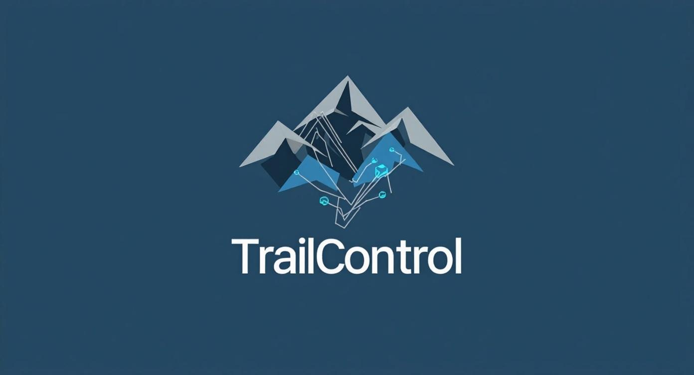

# TrailControl - Smart Contract MultiversX

## Descripció General

TrailControl és un projecte complet de smart contract per a la gestió de checkpoints en rutes, pensat per registrar i consultar punts de control assolits per diferents usuaris (bitlleteres) en temps real sobre la blockchain MultiversX (devnet).

El projecte inclou:
- El codi font del contracte en Rust
- Scripts de build, deploy i upgrade
- Un CLI Python complet per interactuar amb el contracte
- Fitxers de wallet de test
- Proves d'escenari i unitàries

## Funcionalitats Principals

- **Marcar un checkpoint:** Cada wallet pot registrar un checkpoint (id + timestamp) amb una sola crida.
- **Consultar checkpoints d'una wallet:** Es pot consultar la llista de checkpoints assolits per qualsevol wallet.
- **Llistar totes les wallets amb checkpoints:** Es pot obtenir el resum de totes les bitlleteres que han marcat algun punt de control.
- **CLI Python:** Permet interactuar fàcilment amb el contracte (marcar, consultar, resum global).
- **Scripts de deploy/upgrade:** Faciliten la gestió del contracte a la devnet.

## Estructura del Projecte

```
.
├── src/                  # Codi font del contracte TrailControl
├── wasm/                 # Wrapper per generar el WASM
├── interaction/          # Scripts CLI, deploy, upgrade
│   ├── trail_control_cli.py
│   ├── devnet.deploy.sh
│   ├── devnet.upgrade.sh
│   └── CLI_README.md     # 📎 [Documentació CLI](./interaction/CLI_README.md)
├── walletg.pem           # Wallet de test
├── corredor1.pem         # Wallet corredor 1
├── corredor2.pem         # Wallet corredor 2
├── Cargo.toml            # Configuració Rust
├── multiversx.json       # Configuració MultiversX
├── sc-config.toml        # Configuració SC
├── mxsc-template.toml    # Plantilla SC
├── README.md             # Aquest document
```

## Codi i Implementació

### Contracte TrailControl (`src/lib.rs`)
- **Storage:**
	- `VecMapper<Checkpoint>` per cada wallet
	- `UnorderedSetMapper<ManagedAddress>` per llistar wallets actives
- **Endpoints:**
	- `markCheckpoint(checkpoint_id: u32)`
	- `getCheckpointsFor(address: ManagedAddress)`
	- `getAllWallets()`
- **Events:**
	- `CheckpointMarkedEvent` (id, timestamp, indexed address)
- **Encoding:**
	- Tots els tipus amb derives `NestedEncode`, `ManagedVecItem`, etc.

### CLI Python (`interaction/trail_control_cli.py`)
- Marcar checkpoints amb qualsevol wallet PEM
- Consultar checkpoints per adreça o PEM
- Llistar totes les wallets amb checkpoints
- Conversió automàtica d'adreces hex a bech32
- Formatació de timestamps
- Missatges d'error clars

### Scripts
- `devnet.deploy.sh`: Deploy del contracte a la devnet
- `devnet.upgrade.sh`: Upgrade del contracte (WASM)

## Proves Realitzades

- **Unitàries i escenari:**
	- Test de deploy i marcatge de checkpoint
	- Consulta de checkpoints per wallet
	- Llistat global de wallets
- **Prova real a devnet:**
	- Deploy del contracte
	- Marcatge de checkpoints amb diverses wallets (`walletg.pem`, `corredor1.pem`, `corredor2.pem`)
	- Consulta de checkpoints i wallets
	- Validació de timestamps i IDs
	- Verificació a l'explorer de devnet
- **Prova del CLI:**
	- Marcar, consultar, llistar, ajuda
	- Validació d'errors i inputs

## Enllaç destacat

📎 **Documentació completa del CLI:** [interaction/CLI_README.md](./interaction/CLI_README.md)

## Exemple d'ús

```bash
# Marcar checkpoint 5 amb walletg.pem
python interaction/trail_control_cli.py mark walletg.pem 5

# Consultar checkpoints d'una wallet
python interaction/trail_control_cli.py query erd1d8sf28qdes9rjj2rkpvndydanc9n24xsnldnls9gqpy6km3xaflszh8a6c

# Consultar checkpoints des d'un fitxer PEM
python interaction/trail_control_cli.py query-pem corredor1.pem

# Llistar totes les wallets amb checkpoints
python interaction/trail_control_cli.py list
```


## Notes Tècniques

- **Adreça del contracte a devnet:**
	- `erd1qqqqqqqqqqqqqpgq9xrcm5t9axzsdgak3xz3ljqd3gc62xvcafls8uljtt`
- **Enllaç a l'explorador MultiversX:**
	- [Veure contracte a l'explorador](https://devnet-explorer.multiversx.com/accounts/erd1qqqqqqqqqqqqqpgq9xrcm5t9axzsdgak3xz3ljqd3gc62xvcafls8uljtt)
- **Gas limit:** 10_000_000 per transacció
- **Timestamps:** Format Unix
- **Wallets:** Fitxers PEM inclosos per test

## Autor

Projecte TrailControl - MultiversX Smart Contracts

